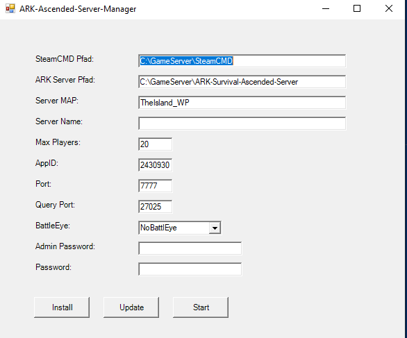
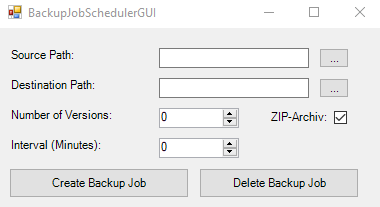

# ARK Ascended Server Manager

ARK Ascended Server Manager is a powerful PowerShell script that simplifies the management of ARK Survival Ascended Servers with a user-friendly graphical interface.

## Features

- **Easy configuration**: Configure server parameters effortlessly through the intuitive user interface, including installation path, map, server name and player limit. All configurations are stored in a JSON file and are easily accessible.

- **Easy installation**: The script automates the installation process using SteamCMD for a hassle-free ARK server setup. No need to navigate through complex command lines - the script takes care of everything.

- **Automatic Updates**: Stay up to date with the latest patches and content by simply updating the server with SteamCMD. Your server is always up to date, without any effort.

- One-click server launch**: Start your ARK game server with a single click. The script creates precise command line arguments based on your configuration, eliminating the need for manual input.

## Compatibility

Developed for Windows Server 2022/2019

## Automatic backup with backup tool

I have developed another tool for the project, which is available as [Backup-Tool](https://github.com/Ch4r0ne/Backup-Tool). It was designed specifically for this project and offers an efficient and user-friendly solution for automatic data backup. The backup button start this tool.

## Port forward Ports
Port = 27015 - UDP (default port is 7777)
QueryPort = 27016 - TCP (currently not yet in use)

    New-NetFirewallRule -DisplayName "ASA Server" -Direction Inbound -LocalPort 27015 -Protocol UDP -Action Allow
    New-NetFirewallRule -DisplayName "ASA Server" -Direction Inbound -LocalPort 27016 -Protocol UDP -Action Allow

## Roadmap

### Main features:

- **RCON transmission**: Function for sending commands via the console in the graphical user interface.
- **Service management**: Start / stop / update / remove services.
- **Display online player count and status**: Display the number of people playing online.
- **Update check**: Automatically check for updates.
- **Discord webhook integration**: Input field and button to enable/disable the Discord webhook.
- Forced stop**: Option to force stop running processes.
- **Edit configuration files**: Access and modify 'Game.ini' and 'GameUserSettings.ini'.

## 🐞 Found a Bug? Help Us Improve!
Welcome to the preview release of ARK-Ascended-Server-Manager! Your feedback is invaluable as we refine the application. If you encounter any bugs or unexpected behavior, please report them on GitHub. Your reports guide us toward a seamless user experience. Thank you for your support!
