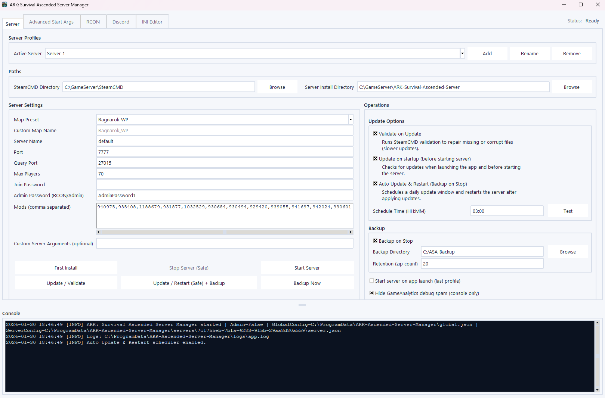

# ARK ASA Server Manager (Windows)

[](https://ark.wiki.gg/wiki/Server_configuration)


[](https://github.com/Ch4r0ne/ARK-Ascended-Server-Manager/releases/latest)
[](https://www.paypal.com/donate/?business=leinich%40me.com&currency_code=EUR)

**ARK ASA Server Manager for Windows** manage **ARK: Survival Ascended (ASA) dedicated servers** with **safe start/stop**, **reliable RCON**, and a clean **staging-based INI workflow**.

> **Disclaimer:** Not affiliated with Studio Wildcard / Snail Games.

---

## Quickstart (recommended)

1. Download the latest EXE: [Releases (latest)](https://github.com/Ch4r0ne/ARK-Ascended-Server-Manager/releases/latest)
2. Start `ARK-ASA-Manager.exe`
3. Run **First Install** once (**Administrator recommended**)
4. Configure **Paths**, **Server Settings**, **Operations**
5. Click **Start Server**
6. Use **Stop Server (Safe)** for controlled shutdown (optional backup + baseline restore)

> The tool is designed to do the safe thing by default: deterministic start-lines, safe stop sequencing, and config handling that prevents half-applied changes.

---

## Preview



---

## Core concept: Staging + Baseline

This manager separates *edit time* and *runtime*:

- **Staging**
  - your edits live here
  - applied to the server folder on **Start**
- **Baseline**
  - created once from the server’s original INIs
  - restored into the server folder on **Stop (Safe)**

> Result: no “half-edited live INIs”, fewer drift issues, and safe rollback without losing your intended changes.

---

## What you get

### First install automation (Admin recommended)
- Installs prerequisites:
  - Visual C++ 2015–2022 Redistributable (x64)
  - DirectX Legacy Runtime (web installer)
  - Amazon certificates (helps on hardened hosts / strict TLS chains)
- Installs **SteamCMD** automatically
- Downloads/updates the ASA dedicated server via SteamCMD

### Safe operations
- **Deterministic start-line generation**  
  Map, ports, session, mods, BattleEye, RCON, cluster, and advanced flags are generated consistently.
- **Safe stop sequence**  
  `SaveWorld` → `DoExit`

### Reliable RCON
- Uses Python **`rcon` (Source RCON)**
- Saved commands + fast execution
- Output written into the shared **Console**

### INI Editor (staging workflow)
- booleans via `True/False` selector
- numeric values via slider + tick marks
- staged writes are debounced to avoid noisy updates


### Advanced start arguments (grouped)
- Cluster configuration
- Dino modes (mutually exclusive)
- Logs
- Mechanics / performance flags

### Backups + retention
- Optional backup on stop
- Zip retention policy
- Optional “include configs” mode

### Auto update & restart
- Time-based update/validate + safe restart
- Skips triggers while the app is busy
- Add the 'Auto Start' option to the last profile on startup.

### CLI flags
- `--no-admin-prompt` (alias: `-no-admin`)
  - Skips the "Administrator rights recommended" dialog
  - Starts directly in non-admin/limited mode
  - No UAC relaunch attempt is made

### Windows autostart
Startup folder runs **at user logon**. For a reliable autostart, prefer **Task Scheduler**.

Shortcut (Startup folder):
```text
"C:\Path\ARK-ASA-Manager.exe" --no-admin-prompt
```

Task Scheduler (recommended, GUI visible):
- Trigger: **At log on**
- General: **Run only when user is logged on**
- Action:
  - Program/script:
    ```text
    C:\Windows\System32\WindowsPowerShell\v1.0\powershell.exe
    ```
  - Add arguments (replace the paths):
    ```text
    -NoProfile -WindowStyle Hidden -ExecutionPolicy Bypass -Command "Start-Process -FilePath '<EXE_FULL_PATH>' -ArgumentList '--no-admin-prompt'"
    ```

---

Option B: Build EXE (PyInstaller)
#### Build command
```powershell
pyinstaller --noconfirm --clean --onefile --windowed `
  --name "ARK-ASA-Manager" `
  --icon ".\assets\app.ico" `
  --add-data ".\assets;assets" `
  --collect-all rcon `
  ".\ARK-Ascended-Server-Manager.py"
```

---

## Trust & integrity (recommended)

Unsigned Windows executables (especially Python GUI + networking features) can trigger SmartScreen/Defender heuristics.

#### Verify SHA256 locally (PowerShell)
```powershell
Get-FileHash -Algorithm SHA256 ".\ARK-ASA-Manager.exe"
```

> Best practice: compare the SHA256 from the Release notes/assets with your local hash before running the binary.

---

## Usage notes

### Multi-instance hosting
- Use **unique ports per instance** (game/query/RCON)
- Use `AltSaveDirectoryName` per instance to keep saves separated
- For clusters: keep **cluster IDs consistent** across instances that should transfer

> Rule of thumb: treat each instance as a separate “service unit” (ports + save path + config), even if they share the same host.

---

## Networking

### Typical defaults (depends on your config)
- **Game Port (UDP):** `7777`
- **Query Port (UDP):** `27015`
- **RCON Port (TCP):** `27020` *(only if RCON enabled)*

### Router / NAT (port forwarding)
Forward ports to the server host:
- `7777/UDP`
- `27015/UDP`
- `27020/TCP` *(optional, only for RCON)*

### Windows Firewall (PowerShell)
#### Allow inbound ports
```powershell
New-NetFirewallRule -DisplayName "ARK ASA Game Port (UDP 7777)"   -Direction Inbound -Action Allow -Protocol UDP -LocalPort 7777
New-NetFirewallRule -DisplayName "ARK ASA Query Port (UDP 27015)" -Direction Inbound -Action Allow -Protocol UDP -LocalPort 27015
New-NetFirewallRule -DisplayName "ARK ASA RCON Port (TCP 27020)"  -Direction Inbound -Action Allow -Protocol TCP -LocalPort 27020
```

### Validate listening ports
#### netstat checks
```powershell
netstat -aon | findstr :7777
netstat -aon | findstr :27015
netstat -aon | findstr :27020
```

---

## Security

### RCON
Do **not** expose RCON to the public internet.

### Credentials
- Keep your Admin/Join password private
- Avoid committing `config.json` or secrets to public repos

---

## Troubleshooting

### “First Install” fails
Run the EXE **as Administrator**. Installers and certificate store writes may fail without elevation.

> Hardened Windows builds often enforce stricter certificate chain rules and installer restrictions.

---

## Dependencies (Official Download Sources)

| Category | Component | Purpose | Source |
|---|---|---|---|
| Runtime | SteamCMD | Install / update ASA dedicated server | [steamcmd.zip](https://steamcdn-a.akamaihd.net/client/installer/steamcmd.zip) |
| Runtime | VC++ 2015–2022 (x64) | Microsoft runtime libraries | [vc_redist.x64.exe](https://aka.ms/vs/17/release/vc_redist.x64.exe) |
| Runtime | DirectX Web Setup | Legacy DirectX components | [dxwebsetup.exe](https://download.microsoft.com/download/1/7/1/1718CCC4-6315-4D8E-9543-8E28A4E18C4C/dxwebsetup.exe) |
| Trust | AmazonRootCA1 | TLS trust chain (hardened hosts / strict chains) | [AmazonRootCA1.cer](https://www.amazontrust.com/repository/AmazonRootCA1.cer) |
| Trust | Amazon R2M02 | TLS trust chain (hardened hosts / strict chains) | [r2m02.cer](https://crt.r2m02.amazontrust.com/r2m02.cer) |

> **Note:** “First Install” may download these components from official vendor endpoints (listed).

<details>
<summary><b>Star History</b></summary>
<br>

[](https://www.star-history.com/#Ch4r0ne/ARK-Ascended-Server-Manager&type=date&legend=bottom-right)

</details>
