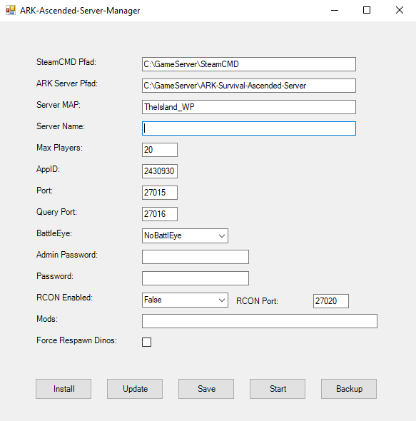

# ARK-Ascended-Server-Manager
This PowerShell script provides a user-friendly GUI for managing ARK Survival Ascended Server:

1. Configuration: Users can set server parameters like installation path, map, server name, player limit, and more via the GUI. Configuration data is saved in a JSON file.
2. Installation: The script can install the ARK server using SteamCMD. It downloads and sets up the necessary files automatically.
3. Update: Users can update the server using SteamCMD, ensuring it's current with the latest patches and content.
4. Start Server: The script constructs command line arguments based on user configuration and launches the server.

This script simplifies the server management process, offering a streamlined interface for both novice and experienced users. Users can easily configure, install, update, and start ARK game servers without delving into complex command lines or configurations.

## Build for Windows Server 2022 / 2019



## Port forward Ports
- Port = 27015 - UDP 
- QueryPort = 27016 - TCP

```
New-NetFirewallRule -DisplayName "ASA Server" -Direction Inbound -LocalPort 27015 -Protocol UDP -Action Allow
New-NetFirewallRule -DisplayName "ASA Server" -Direction Inbound -LocalPort 27016 -Protocol UDP -Action Allow
```

## 🔍 Found a Bug? Help Us Improve!
Hello developers and early adopters! Welcome to our app's preview release. 
Your feedback is crucial as we refine every detail. 
If you encounter any bugs or unexpected behavior, please report them on GitHub. 
Your reports guide us toward a seamless user experience. Thank you!
