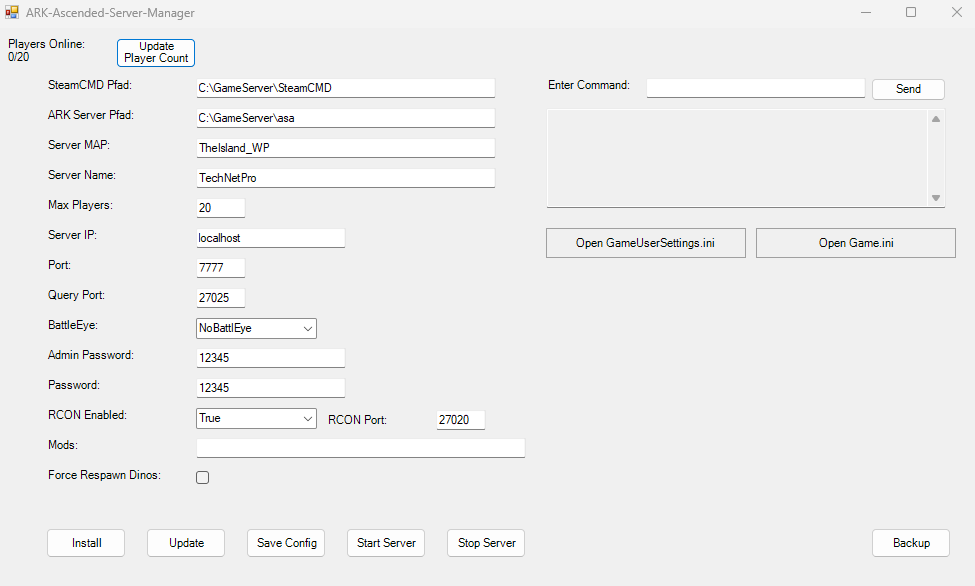

# ARK Ascended Server Manager
[](https://discord.gg/7tvmSdXcEH)

ARK Ascended Server Manager simplifies the management of ARK Survival Ascended Servers with ease and efficiency.

## Key Features

- **Simple Configuration**: Adjust server settings effortlessly through an intuitive interface.
- **Seamless Installation**: Automated setup using SteamCMD for hassle-free server deployment.
- **Automatic Updates**: Keep your server current with seamless patching via SteamCMD.
- **One-Click Launch**: Start your server with a single click.
- **RCON Integration**: Send commands via the console.
- **Configuration Editing**: Modify 'Game.ini' and 'GameUserSettings.ini' easily.

## Compatibility

Compatible with Windows Server 2022/2019.



## Automatic Backup Tool

Enhance management with our dedicated [Backup Tool](https://github.com/Ch4r0ne/Backup-Tool).

## Port Forwarding

Configure port forwarding:

- Port: 27015 (UDP) - Default: 7777
```powershell
New-NetFirewallRule -DisplayName "ASA Server" -Direction Inbound -LocalPort 27015 -Protocol UDP -Action Allow
```
- QueryPort: 27016 (TCP) - Not in use
```powershell
New-NetFirewallRule -DisplayName "ASA Server" -Direction Inbound -LocalPort 27016 -Protocol TCP -Action Allow
```

# Parameter Overview

For a comprehensive overview of parameters, please refer to the [Server Configuration](https://ark.wiki.gg/wiki/Server_configuration).

## Manual Setup Guide

For detailed setup instructions, please visit the [Dedicated Server Setup](https://ark.wiki.gg/wiki/Dedicated_server_setup#Windows_Server_editions_and_crossplay_with_Epic_players) page.

If you prefer not to use the manager, an automatic installation script for the certificate is available: [UnrealEngine_Dedicated_Server_Install_CA](https://github.com/Ch4r0ne/UnrealEngine_Dedicated_Server_Install_CA#UnrealEngine_Dedicated_Server_Install_CA)

## 🐞 Found a Bug? Help Us Improve!
Welcome to the preview release of ARK-Ascended-Server-Manager! Your feedback is invaluable as we refine the application. If you encounter any bugs or unexpected behavior, please report them on GitHub. Your reports guide us toward a seamless user experience. Thank you for your support!

## External Resources Used in this Script
- **mcrcon for RCON**: [https://github.com/Tiiffi/mcrcon/releases/download/v0.7.2/mcrcon-0.7.2-windows-x86-64.zip](https://github.com/Tiiffi/mcrcon/releases/download/v0.7.2/mcrcon-0.7.2-windows-x86-64.zip)
- **AutoUpdateJob (if selected)**: [https://raw.githubusercontent.com/Ch4r0ne/ARK-Ascended-Server-Manager/main/AutoUpdateJob.ps1](https://raw.githubusercontent.com/Ch4r0ne/ARK-Ascended-Server-Manager/main/AutoUpdateJob.ps1)
- **Backup Tool (if selected)**: [https://github.com/Ch4r0ne/Backup-Tool/releases/download/1.0.3/BackupJobSchedulerGUI.msi](https://github.com/Ch4r0ne/Backup-Tool/releases/download/1.0.3/BackupJobSchedulerGUI.msi)
- **SteamCMD**: [https://steamcdn-a.akamaihd.net/client/installer/steamcmd.zip](https://steamcdn-a.akamaihd.net/client/installer/steamcmd.zip)
- **Visual C++ Redistributable**: [https://aka.ms/vs/17/release/vc_redist.x64.exe](https://aka.ms/vs/17/release/vc_redist.x64.exe)
- **DirectX Runtime**: [https://download.microsoft.com/download/1/7/1/1718CCC4-6315-4D8E-9543-8E28A4E18C4C/dxwebsetup.exe](https://download.microsoft.com/download/1/7/1/1718CCC4-6315-4D8E-9543-8E28A4E18C4C/dxwebsetup.exe)
- **Amazon Certificate**:
  - Root CA1: [https://www.amazontrust.com/repository/AmazonRootCA1.cer](https://www.amazontrust.com/repository/AmazonRootCA1.cer)
  - Root CA r2m02: [http://crt.r2m02.amazontrust.com/r2m02.cer](http://crt.r2m02.amazontrust.com/r2m02.cer)
