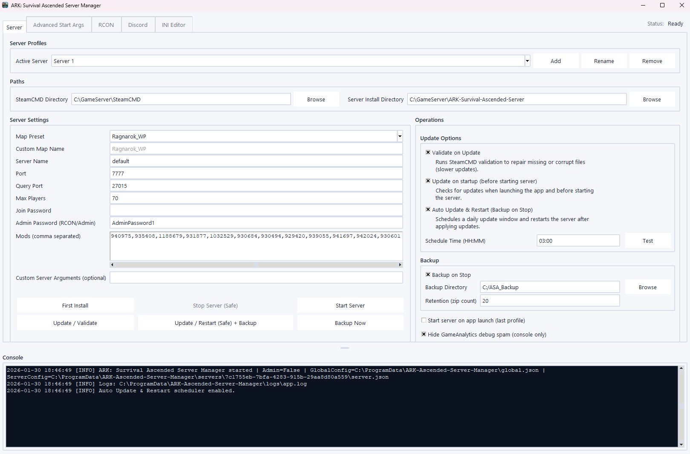
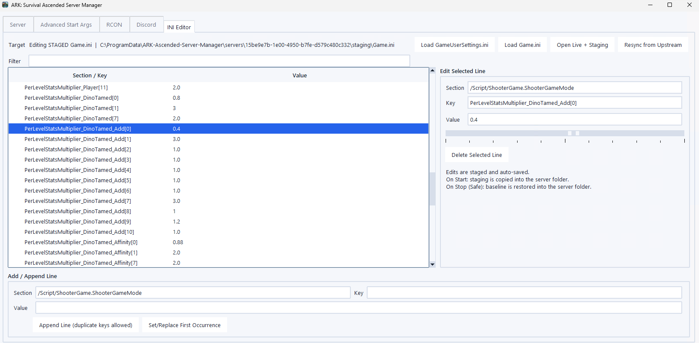

# ARK ASA 服务器管理器（Windows）

[English](README.md) | [简体中文](README.zh-CN.md)

[](https://ark.wiki.gg/wiki/Server_configuration)


[](https://github.com/Ch4r0ne/ARK-Ascended-Server-Manager/releases/latest)
[](https://www.paypal.com/donate/?business=leinich%40me.com&currency_code=EUR)

**ARK ASA 服务器管理器（Windows）** 用于管理 **ARK: Survival Ascended (ASA) 专用服务器**，提供**安全的启动/停止**、**可靠的 RCON** 以及清晰的**基于暂存区的 INI 工作流**。

> **免责声明：** 与 Studio Wildcard / Snail Games 无任何关联。

---

## 快速开始（推荐）

1. 下载最新的 EXE：[Releases（最新版）](https://github.com/Ch4r0ne/ARK-Ascended-Server-Manager/releases/latest)
2. 启动 `ARK-ASA-Manager.exe`
3. 运行一次 **首次安装**（**建议以管理员身份运行**）
4. 配置 **路径**、**服务器设置**、**操作选项**
5. 点击 **启动服务器**
6. 使用 **停止服务器（安全）** 进行受控关闭（可选备份 + 基线恢复）

> 该工具默认执行安全操作：确定性的启动命令行、安全的关闭流程，以及防止半生效更改的配置处理机制。

---

## 预览



---

## 核心理念：暂存区 + 基线

本管理器将*编辑*和*运行*分离：

- **暂存区（Staging）**
  - 你的编辑保存在这里
  - 点击**启动**时应用到服务器目录
- **基线（Baseline）**
  - 从服务器原始 INI 一次性创建
  - 执行**停止（安全）**时恢复到服务器目录

> 结果：不再有"半编辑的实时 INI"，减少配置漂移，并且可以在不丢失你意图更改的前提下安全回滚。

---

## 功能一览

### 首次安装自动化（建议以管理员身份运行）
- 安装必要组件：
  - Visual C++ 2015–2022 运行库（x64）
  - DirectX Legacy Runtime（Web 安装程序）
  - Amazon 证书（在加固或严格 TLS 链的主机上使用）
- 自动安装 **SteamCMD**
- 通过 SteamCMD 下载/更新 ASA 专用服务器

### 安全操作
- **确定性启动命令行生成**  
  地图、端口、会话、Mod、BattleEye、RCON、集群以及高级标志均以一致的方式生成。
- **安全关闭流程**  
  `SaveWorld` → `DoExit`

### 可靠的 RCON
- 使用 Python **`rcon`（Source RCON 协议）**
- 保存常用命令 + 快速执行
- 输出写入共享**控制台**

### INI 编辑器（暂存区工作流）
- 布尔值使用 `True/False` 选择器
- 数值使用滑块 + 刻度标记
- 暂存写入带防抖，避免频繁更新



### 高级启动参数（分组管理）
- 集群配置
- 恐龙模式（互斥）
- 日志
- 机制 / 性能标志

### 备份与保留
- 停止时可选择备份
- Zip 保留数量策略
- 可选"包含配置文件"模式

### 自动更新与重启
- 定时更新/验证 + 安全重启
- 应用繁忙时跳过触发
- 支持在启动时为上一次使用的配置文件添加"自动启动"

### CLI 参数
- `--no-admin-prompt`（别名：`-no-admin`）
  - 跳过"建议以管理员身份运行"的提示对话框
  - 直接以非管理员/受限模式启动
  - 不尝试 UAC 提权

### Windows 自启动
启动文件夹在**用户登录时**运行。如需可靠的自启动，建议使用**任务计划程序**。

快捷方式（启动文件夹）：
```text
"C:\Path\ARK-ASA-Manager.exe" --no-admin-prompt
```

任务计划程序（推荐，GUI 可见）：
- 触发器：**用户登录时**
- 常规：**仅当用户登录时运行**
- 操作：
  - 程序或脚本：
    ```text
    C:\Windows\System32\WindowsPowerShell\v1.0\powershell.exe
    ```
  - 添加参数（替换路径）：
    ```text
    -NoProfile -WindowStyle Hidden -ExecutionPolicy Bypass -Command "Start-Process -FilePath '<EXE_FULL_PATH>' -ArgumentList '--no-admin-prompt'"
    ```

---

## 备选方案：自行构建 EXE（PyInstaller）

#### 构建命令
```powershell
pyinstaller --noconfirm --clean --onefile --windowed `
  --name "ARK-ASA-Manager" `
  --icon ".\assets\app.ico" `
  --add-data ".\assets;assets" `
  --collect-all rcon `
  ".\ARK-Ascended-Server-Manager.py"
```

---

## 信任与完整性（推荐）

未签名的 Windows 可执行文件（特别是包含 Python GUI + 网络功能的程序）可能触发 SmartScreen / Defender 启发式检测。

#### 本地验证 SHA256（PowerShell）
```powershell
Get-FileHash -Algorithm SHA256 ".\ARK-ASA-Manager.exe"
```

> 最佳实践：在运行二进制文件之前，将 Release 页面提供的 SHA256 与本地的哈希值进行比对。

---

## 使用说明

### 多实例架设
- 每个实例使用**独立的端口**（游戏/查询/RCON）
- 为每个实例设置独立的 `AltSaveDirectoryName` 以隔离存档
- 集群：确保需要互通的实例**集群 ID 保持一致**

> 经验法则：将每个实例视为一个独立的"服务单元"（端口 + 存档路径 + 配置），即使它们共享同一台主机。

---

## 网络配置

### 典型默认端口（取决于你的配置）
- **游戏端口（UDP）：** `7777`
- **查询端口（UDP）：** `27015`
- **RCON 端口（TCP）：** `27020` *（仅当启用 RCON 时需要）*

### 路由器 / NAT（端口转发）
将以下端口转发到服务器主机：
- `7777/UDP`
- `27015/UDP`
- `27020/TCP` *（可选，仅 RCON 需要）*

### Windows 防火墙（PowerShell）
#### 允许入站端口
```powershell
New-NetFirewallRule -DisplayName "ARK ASA Game Port (UDP 7777)"   -Direction Inbound -Action Allow -Protocol UDP -LocalPort 7777
New-NetFirewallRule -DisplayName "ARK ASA Query Port (UDP 27015)" -Direction Inbound -Action Allow -Protocol UDP -LocalPort 27015
New-NetFirewallRule -DisplayName "ARK ASA RCON Port (TCP 27020)"  -Direction Inbound -Action Allow -Protocol TCP -LocalPort 27020
```

### 验证监听端口
#### netstat 检查
```powershell
netstat -aon | findstr :7777
netstat -aon | findstr :27015
netstat -aon | findstr :27020
```

---

## 安全

### RCON
**不要**将 RCON 暴露到公网。

### 凭证
- 保管好你的管理员/加入密码
- 避免将 `config.json` 或密钥提交到公开仓库

---

## 故障排除

### "首次安装"失败
以**管理员身份**运行 EXE。安装程序和证书存储写入操作可能因权限不足而失败。

> 加固过的 Windows 系统通常强制执行更严格的证书链规则和安装程序限制。

---

## 依赖项（官方下载源）

| 分类 | 组件 | 用途 | 来源 |
|---|---|---|---|
| 运行时 | SteamCMD | 安装 / 更新 ASA 专用服务器 | [steamcmd.zip](https://steamcdn-a.akamaihd.net/client/installer/steamcmd.zip) |
| 运行时 | VC++ 2015–2022 (x64) | Microsoft 运行库 | [vc_redist.x64.exe](https://aka.ms/vs/17/release/vc_redist.x64.exe) |
| 运行时 | DirectX Web Setup | 旧版 DirectX 组件 | [dxwebsetup.exe](https://download.microsoft.com/download/1/7/1/1718CCC4-6315-4D8E-9543-8E28A4E18C4C/dxwebsetup.exe) |
| 信任链 | AmazonRootCA1 | TLS 信任链（加固/严格链主机） | [AmazonRootCA1.cer](https://www.amazontrust.com/repository/AmazonRootCA1.cer) |
| 信任链 | Amazon R2M02 | TLS 信任链（加固/严格链主机） | [r2m02.cer](https://crt.r2m02.amazontrust.com/r2m02.cer) |

> **注意：** "首次安装"可能会从上述官方供应商端点下载这些组件。

<details>
<summary><b>Star 历史</b></summary>
<br>

[](https://www.star-history.com/#Ch4r0ne/ARK-Ascended-Server-Manager&type=date&legend=bottom-right)

</details>
